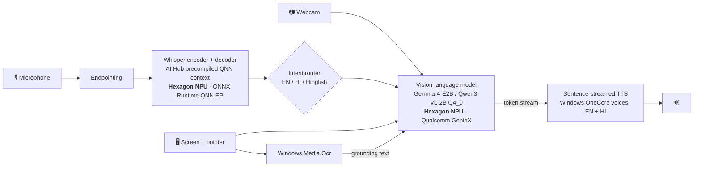

# Netra (नेत्र): see your screen, privately

**An offline voice and vision assistant for blind and low-vision PC users, running entirely on the Snapdragon® Hexagon™ NPU.**

Press a key and ask *"Why did my upload fail?"* or *"इस बिल में कितना पैसा देना है?"*. Netra listens with Whisper on the NPU, looks at your screen or webcam, reasons with a vision-language model on the NPU, and answers out loud in English or Hindi. Nothing leaves the laptop.

> Built for the Snapdragon AI Lab Build & Present Challenge 2026. Target: Snapdragon X / X2 powered HP PCs.

---

## Why this matters

Screen readers such as NVDA and Narrator only work when an app exposes accessibility labels. In practice, much of what Indian users need to read does not:

- **Government and banking portals** often show errors, captchas and status as images or unlabeled widgets.
- **Scanned PDFs, photos of notices and bills** contain no text layer at all.
- **Physical things** (medicine strips, currency notes, letters) need a second pair of eyes.

Cloud "describe my screen" tools exist, but they upload your screen: bank balances, Aadhaar numbers, medical records. They also stop working on a patchy connection. **Netra keeps every pixel and every word on the device**, because the Snapdragon NPU makes a vision-language model fast enough to run locally on battery.

## What it does

| Say or press | Netra |
|---|---|
| **Ctrl+Alt+Space**, then ask anything | Answers questions about what is on screen, e.g. *"what does this error say?"*, *"where is the submit button?"* |
| "Describe the screen" / "स्क्रीन पर क्या है" · **Ctrl+Alt+D** | App or page, key content, and controls with their positions |
| "Read the screen" / "स्क्रीन पढ़ो" · **Ctrl+Alt+R** | Reads all text verbatim in reading order (OCR) |
| "What's under my mouse?" | Zooms in around the pointer and explains it |
| "What am I holding?" / "कौन सा नोट है?" · **Ctrl+Alt+C** | Webcam: currency denomination, medicine name and expiry, documents |
| "Stop" / "रुको", "Repeat" / "दोबारा", "Faster", "Slower" | Speech control at any time (**Ctrl+Alt+S** stops, **Ctrl+Alt+A** repeats) |

Designed for eyes-free use:
- **Earcons** confirm listening, thinking and error states.
- Speech is **streamed sentence by sentence**, so the answer starts while the model is still generating.
- Everything can be **interrupted**.
- A **companion dashboard** (`http://127.0.0.1:8765`) puts answers in an ARIA live region, so NVDA users and sighted helpers can follow along or type questions.

## How it uses the Snapdragon NPU



| Stage | Model | Runtime | Compute unit |
|---|---|---|---|
| Speech-to-text | Whisper-Base (AI Hub `whisper_base`, precompiled QNN context binaries) | ONNX Runtime + `onnxruntime-qnn` plugin EP | **Hexagon NPU (HTP)** |
| Screen / camera understanding | `google/gemma-4-E2B-it-qat-q4_0-gguf` (image + audio, strong Hindi) or AI Hub `Qwen3-VL-2B-Instruct` | Qualcomm AI Hub **GenieX** (`geniex serve`, OpenAI-compatible) | **Hexagon NPU** (`--compute npu`) |
| OCR grounding | Windows.Media.Ocr | WinRT | CPU (≈100 ms) |
| Speech output | Windows OneCore neural voices (e.g. Heera en-IN, Kalpana hi-IN) | WinRT | CPU |

**OCR-grounded VLM.** The screenshot goes to the VLM together with the OCR text in reading order. The VLM supplies layout and meaning ("the red banner under the form"), and OCR supplies exact characters: amounts, dates, file sizes. Small on-device models hallucinate much less this way.

**Two Qualcomm runtimes, one app.** Whisper runs through ONNX Runtime's QNN execution provider on AI Hub's precompiled context binaries. The VLM runs through GenieX's llama.cpp Hexagon backend. Each is the recommended path for its model family, and `netra doctor` verifies both.

## Install on a Snapdragon PC (Windows 11 ARM64)

```powershell
git clone <this repo> netra; cd netra
Set-ExecutionPolicy -Scope Process Bypass -Force
.\scripts\install.ps1      # ARM64 Python, deps, Whisper NPU model, GenieX + VLM
.\scripts\start.ps1        # starts `geniex serve` on the NPU, then Netra
```

Then check everything is on the NPU:

```powershell
uv run netra doctor
uv run netra bench --out docs\bench_snapdragon.json
```

No Snapdragon laptop at hand? [Qualcomm Developer Cloud](https://qdc.qualcomm.com/) gives remote sessions on Snapdragon X Elite / X2 Elite. `tools/aihub_profile.py` compiles and profiles the Whisper models on AI Hub's hosted X Elite and X2 Elite devices.

## Develop on macOS (or any laptop)

The same code runs with dev fallbacks: faster-whisper on the CPU, Apple Vision OCR, llama.cpp on Metal serving the same VLM family through the same OpenAI API.

```bash
uv sync --extra camera
./scripts/dev_brain.sh &                      # llama-server + Qwen3-VL-2B on :8080
uv run netra ask --audio samples/question.wav --image samples/error_dialog.png
uv run netra run                              # hotkeys + dashboard
NETRA_SCREEN_IMAGE=samples/hindi_bill.png uv run netra run --no-hotkeys   # demo without screen permission
```

macOS needs **Screen Recording** and **Accessibility** permission for your terminal to capture the screen and use global hotkeys.

## Benchmarks

| Stage | Snapdragon X Elite (NPU) | Apple M5 (dev fallback) |
|---|---|---|
| Speech-to-text, 3 s question | *to be measured* | 519 ms (CPU, faster-whisper) |
| OCR, 1600×1000 screenshot | *to be measured* | 86 ms (Apple Vision) |
| VLM first token (screenshot + question) | *to be measured* | 1959 ms (Metal) |
| VLM full answer | *to be measured* | 3546 ms (Metal) |

Reproduce with `uv run netra bench` (median of 3 runs after warm-up; the VLM input changes one pixel per run so server caches cannot skip work). The raw output is in `docs/`.

## Example

Input: [`samples/error_dialog.png`](samples/error_dialog.png), a scholarship portal whose error banner is an image, plus the spoken question *"Why did my upload fail, and what should I do?"*

> Your upload failed because the Caste certificate is too large. It must be under 2 MB. You should choose a file that is under 2 MB and in PDF or JPG format. The deadline for this step is 31 October 2026.

Hindi, with [`samples/hindi_bill.png`](samples/hindi_bill.png): *"मुझे कितना पैसा देना है और कब तक?"*

> भुगतान के लिए आपके बकाया राशि ₹ 2,340 है। अंतिम तिथि 5 अक्टूबर 2026 है। भुगतान करने के लिए आप अभी भुगतान करें।

## Project layout

```
netra/
  asr/qnn_whisper.py   Whisper on the NPU (static KV-cache decode, forced EN/HI prompting)
  asr/cpu_whisper.py   dev fallback
  brain.py             OpenAI-compatible VLM client (GenieX / llama.cpp), prompts for spoken answers
  vision.py            screen capture with pointer ring, webcam, native OCR in reading order
  speech.py            streamed, interruptible TTS (OneCore / SAPI / macOS say)
  router.py            EN/HI/Hinglish intent rules
  assistant.py         the pipeline + timing events
  dashboard.py         accessible live dashboard (stdlib HTTP + SSE)
  device.py            Snapdragon detection, QNN EP session factory
scripts/  install.ps1 · start.ps1 · dev_brain.sh · make_samples.py
tools/    aihub_profile.py (AI Hub hosted-device profiling)
```

## Roadmap

- Silero VAD (on AI Hub) on the NPU for hands-free wake-up.
- AI Hub `whisper_small` export for better Hindi, plus Marathi, Tamil and Bengali prompts.
- UI Automation tree fusion, so answers can say "Tab 3 times to reach Save & Next".
- Currency and medicine fine-tuned detectors (AI Hub YOLO/RT-DETR) for instant camera answers.
- Signed MSIX installer.

## Credits and licences

- `netra/asr/qnn_whisper.py` and `netra/device.py` adapt code from Qualcomm [ai-hub-apps](https://github.com/qualcomm/ai-hub-apps) (BSD-3-Clause).
- Models: OpenAI Whisper (MIT), Google Gemma (Gemma Terms of Use), Qwen3-VL (Apache-2.0), all via [Qualcomm AI Hub](https://aihub.qualcomm.com) / Hugging Face.
- Netra itself is MIT-licensed.
